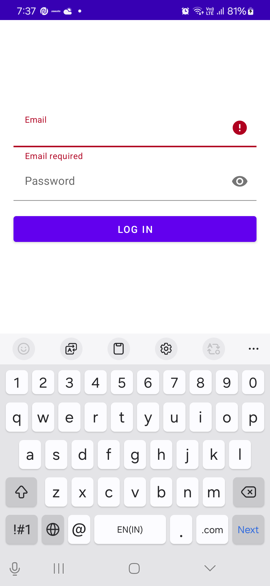
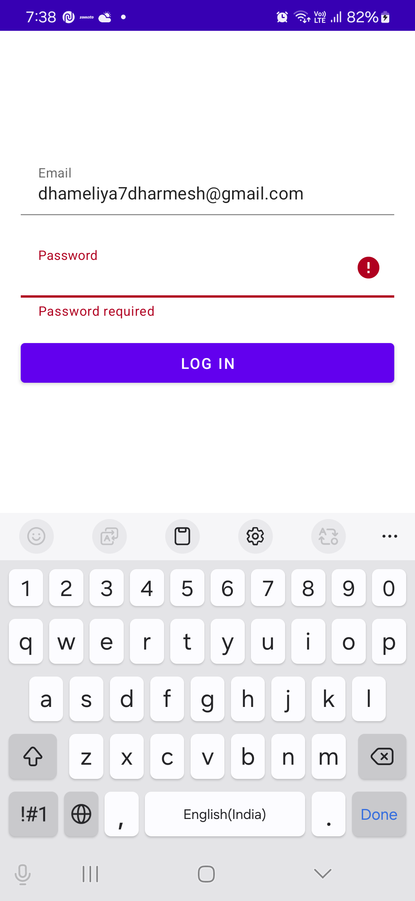
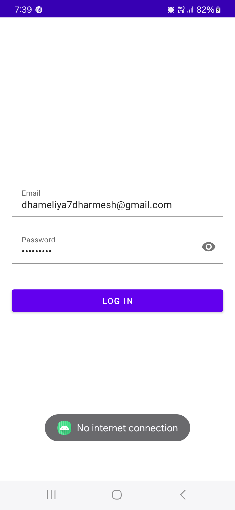

# JAVA MVVM SAMPLE
This is Java-based MVVM Architecture Android Project Sample.

# Architecture
- MVVM (Model-View-ViewModel)

# Features
- Email Authentication

# UI/UX
- Responsive UI Pages With ConstraintLayout
- Material Design Components
<table>
  <tr>
    <td></td>
    <td></td>
    <td></td>
    <td></td>
  </tr>
</table>

# Libraries
- AndroidX
- [Retrofit](https://github.com/square/retrofit)
- [Scalable size unit](https://github.com/intuit/sdp)

# Language
Kotlin and Java
